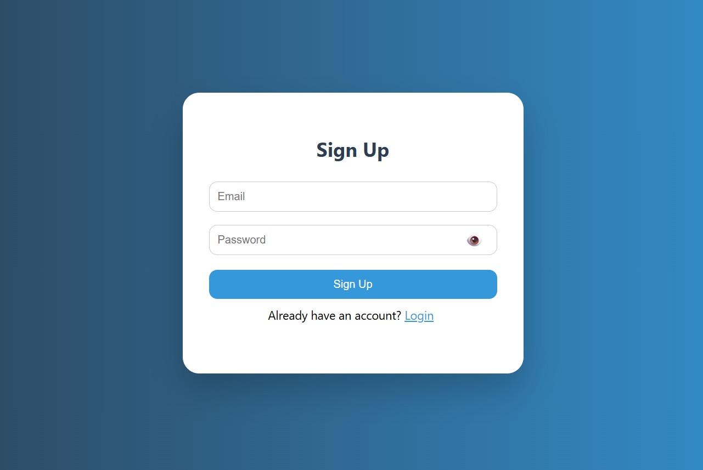
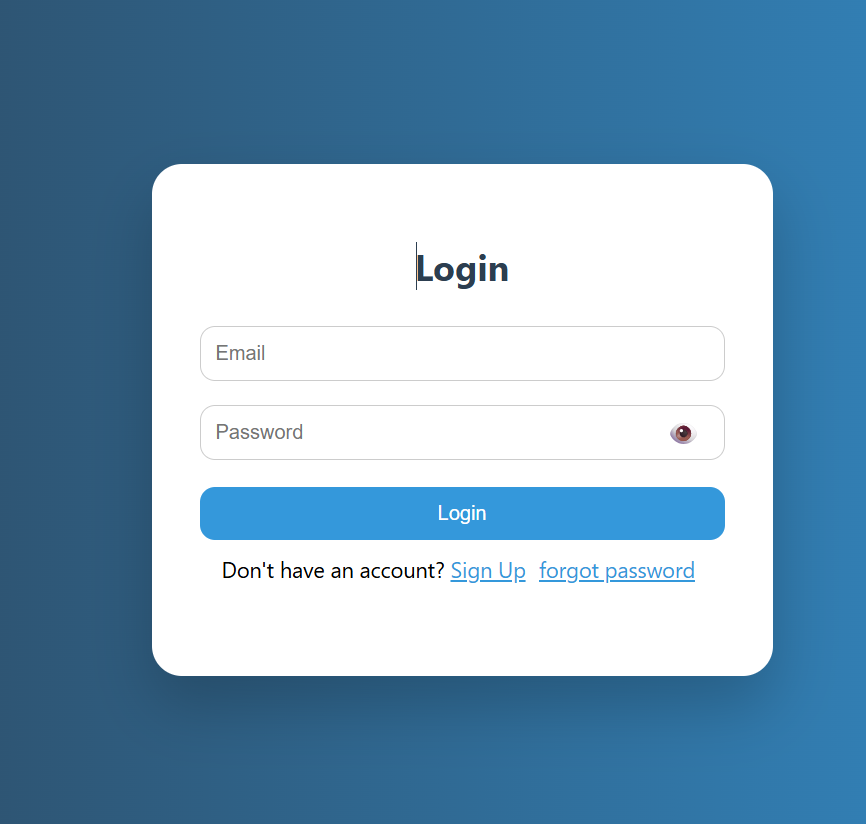
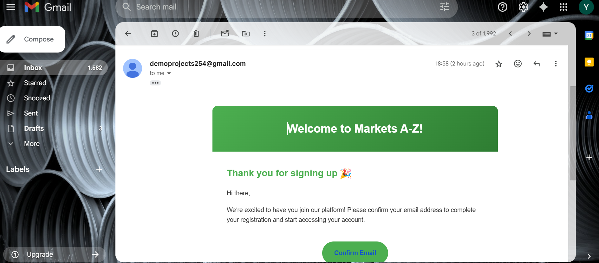
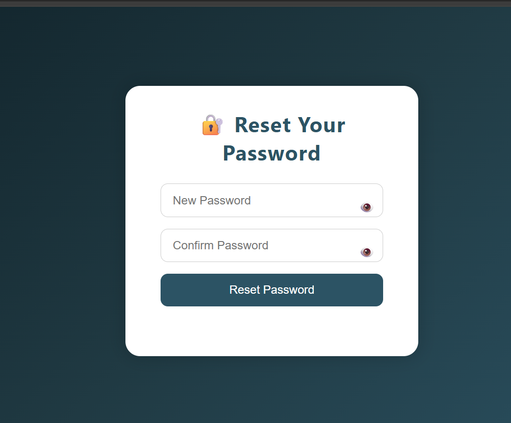
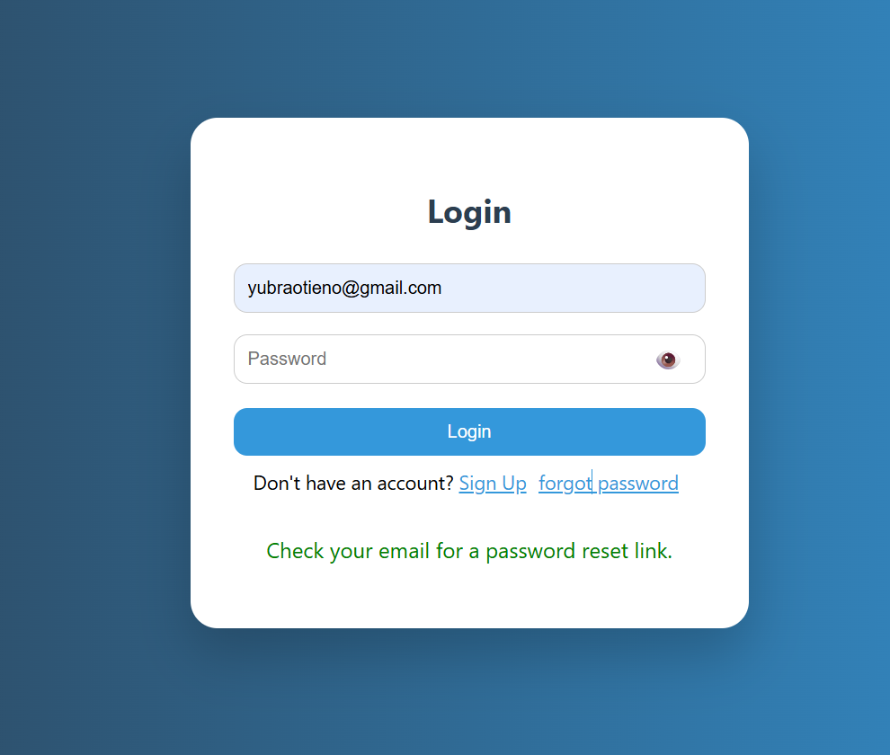
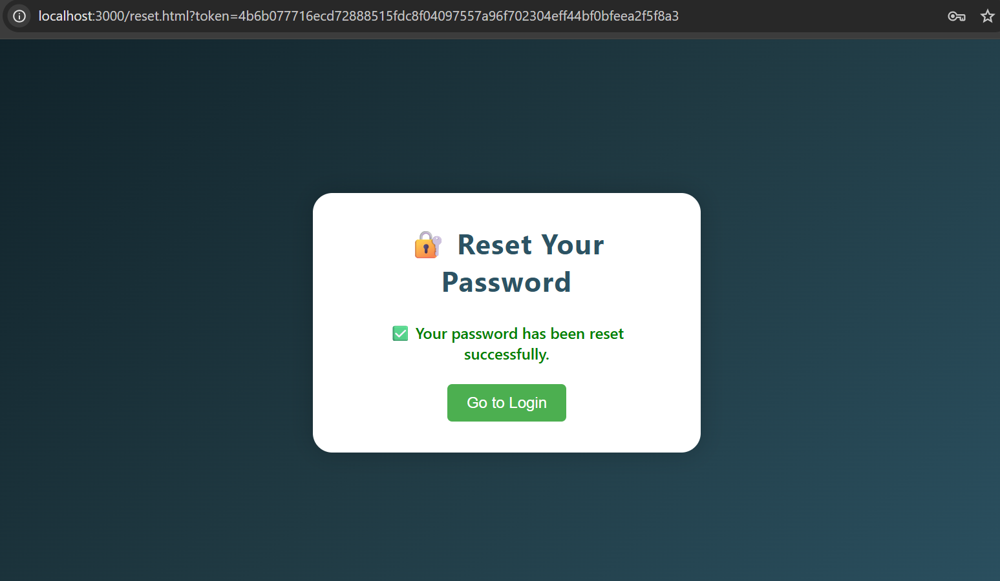

# 🛡️ Node.js Authentication System with Email Verification & Password Reset

Welcome to the **Markets A-Z Auth System** — a modern authentication backend built with **Node.js**, **Express**, and **MongoDB**. It features secure signup, login, email verification, and password reset functionality, all integrated into a smooth and animated frontend experience.

---

## 🚀 Features

- ✅ User Signup with email verification  
- 🔐 Secure Login using salted & hashed passwords  
- 🔁 Password reset via email with secure token  
- 📧 Email verification system using Gmail SMTP  
- 🎨 Fully animated and modern frontend (HTML/CSS/JS)  
- 🧠 MongoDB integration without Mongoose (uses `mongodb` native driver)

---

## 🧰 Technologies Used

- **Backend**: Node.js, Express.js  
- **Database**: MongoDB (via `mongodb` driver)  
- **Frontend**: HTML5, CSS3, Vanilla JavaScript  
- **Email**: Nodemailer with Gmail SMTP  
- **Security**: `bcrypt`, `crypto`, secure token handling  
- **Environment**: dotenv

---

## 🛠️ How to Run This Project

### 1. Clone the Repository

-bash
-git clone https://github.com/yubra840/node-auth-system.git
-cd node-auth-system
### 2. Install Dependencies
-bash
-npm install
### 3. Create .env File
-Inside the project root, create a .env file with the following contents:
PORT=3000
MONGO_URI=mongodb+srv://<your-mongodb-uri>
Replace <your-mongodb-uri> with your actual connection string from MongoDB Atlas.

### 4. Set Up Gmail for Nodemailer
-Go to Google App Passwords

-Generate a new App Password for your Gmail

-Replace the credentials inside authRoutes.js and passwordRoutes.js:

-js
-user: "your-email@gmail.com",
-pass: "your-app-password"
### 5. Run the Server
-bash
-node node-auth-system-sever.js
-Visit the frontend by opening signup.html or login.html in your browser.

## 💡 Notes
-Ensure MongoDB is connected and the URI is correct.

-Tokens are stored in the user collection to manage password reset and verification.

-This system does not use Mongoose, making it lighter and more native to the mongodb package.

-Make sure to handle .env securely and never commit sensitive data.
## 📬 Contact
-Have feedback or need help or need a video showcasing full functionality of the aplication?
-📧 Email: yubraotieno@gmail.com
-🌐 Project by: Yubra FX

---
## 📝 License
-This project is licensed under the MIT License — feel free to use and modify it for your own projects.

## 📸 Screenshots

### 📝 Signup Page

### 🔐 Login Page

### 📩 Email Confirmation Message

### 🤯 Forgot Password Page

### 🔄 Reset Password Page

### 🎉 Success Page

